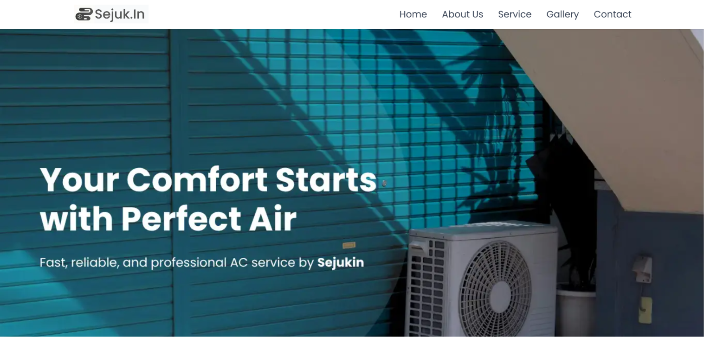
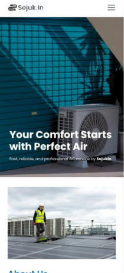

**Sejukin — AC Service Landing Page**

A modern and responsive AC service landing page built with Next.js, Tailwind CSS, and TypeScript.

This project was created as a personal portfolio project to showcase modern frontend development practices, responsive layouts, animation, and clean UI implementation.

**Disclaimer**

All content used in this project — including:

- business name
- services
- contact information
- testimonials
- images
- other branding elements

are entirely fictional and used for demonstration and portfolio purposes only.

This project is not associated with a real company or commercial AC service provider.

**Preview**

Desktop Preview

Mobile Preview

**Tech Stack**

- Next.js
- React
- Tailwind CSS
- TypeScript

**Features**

- Modern responsive landing page
- Mobile-friendly navigation
- Smooth UI animation and transition
- Optimized image rendering with next/image
- Service showcase section
- Gallery section
- Testimonial section
- Contact section
- SEO metadata support
- Static optimized build

**Getting Started**

1. Clone Repository
   git clone https://github.com/akmalyusufhanifan/sejukin.git
2. Navigate to Project Folder
   cd sejukin
3. Install Dependencies
   npm install
4. Run Development Server
   npm run dev

Open:
http://localhost:3000

**Production Build**

To create an optimized production build:

> npm run build

To run production mode locally:

> npm run start

**Project Structure**

src/
├── app/
├── components/
├── sections/
├── assets/
├── lib/
└── utils/

**SEO**

This project includes:

- metadata configuration
- Open Graph support
- responsive viewport setup
- semantic HTML structure

**Image Credits**

All images used in this project belong to their respective owners.

Below are the sources/references for the images used:

- [Hero / Banner Images](https://unsplash.com/id/foto/ac-yang-berada-di-luar-gedung-_7huNth8Y2s)
- [About Image](https://unsplash.com/id/foto/seorang-pria-berdiri-di-atas-atap-BU8lpW2Bn30)
- Service Images
  - [Service 1](https://unsplash.com/id/foto/unit-ac-putih-menampilkan-22-derajat-mM0vW68NY0g)
  - [Service 2](https://unsplash.com/id/foto/unit-kondensor-udara-putih-JBw9IlbHhVY)
  - [Service 3](https://unsplash.com/id/foto/beberapa-pria-berdiri-di-atas-atap-iS5GDeLDk0E)
  - [Service 4](https://unsplash.com/id/foto/unit-kondensor-ac-putih-f1f-FQj0k0U)
- [Gallery Images](https://unsplash.com)

**Deployment**

Recommended platform:

- Vercel

Deploy instantly by connecting your GitHub repository to Vercel.

**Lighthouse Goals**

Target optimization score:

- Performance: 90+
- Accessibility: 90+
- Best Practices: 90+
- SEO: 90+

**License**

This project is created for educational and portfolio purposes only.

You are free to explore, modify, and learn from the code.

**Author**

Developed by **Akmal Yusuf Hanifan**

GitHub:

https://github.com/akmalyusufhanifan
